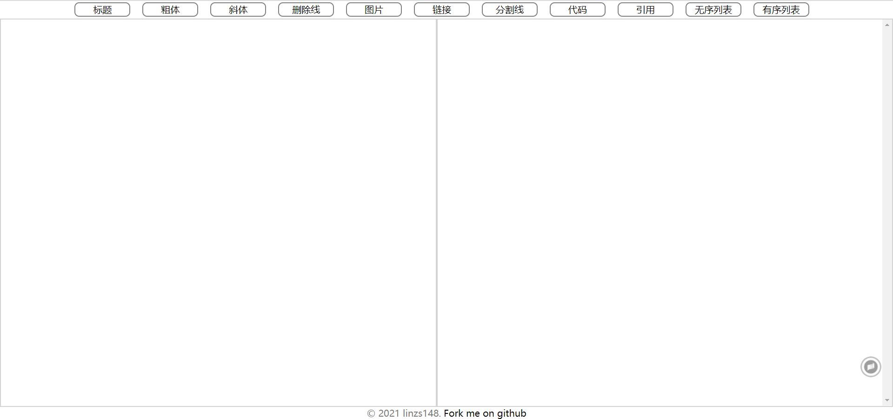

# tech-training-camp-frontend

# 在线Markdown编辑器

---

[TOC]

---

## 项目结构

> tech-training-camp-frontend
> ├─index.html //在线Markdown编辑器主页面
> ├─README.md
> ├─js //js文件夹
> | └index.js
> ├─image //图片文件夹
> |   └show.png
> ├─css //css文件夹
> |  └style.css
> ├─.git

---

## 项目说明

本次项目为字节跳动训练营第六期大作业，要求是基于**HTML**、**CSS**和**JavaScript**实现一个在线的Markdown编辑器

### 成果链接

[Markdown Oline](https://linzs148.github.io/tech-training-camp-frontend/)

### 成果展示

### 实现的功能

1. 实现常用的Markdown语法转换，包括

   * 标题
   * 粗体
   * 斜体
   * 粗斜体
   * 删除线
   * 分割线
   * 图片
   * 链接
   * 代码块
   * 引用块
   * 嵌套引用块
* 段落中的代码
2. 支持使用顶部工具栏按钮进行操作，以便于不熟悉Markdown语法的初学者进行书写

---

## 项目思路

### 结构布局

整体的布局分为4个部分，分别为

* 顶部的header，负责
* mainbody的left区域，负责
* mainbody的right区域，负责
* 底部的footer，，，

### 风格样式

### 转换逻辑

基于正则表达式

---

## 项目困难

---

## 项目不足

1. 嵌套
2. 样式风格
3. 滚动条同步
4. marked.js

---

## 致谢